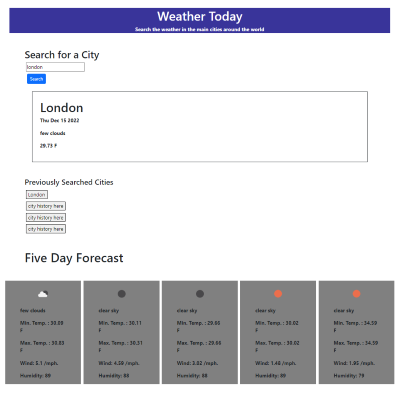
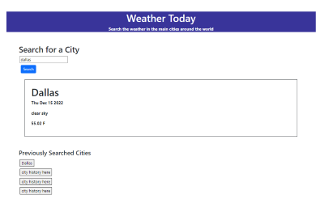
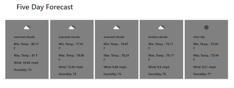
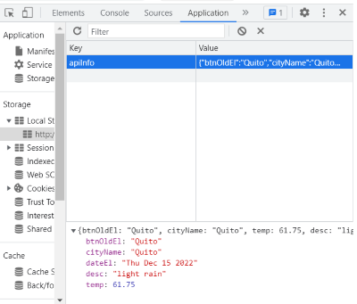

# Weather Forecast

## Description

The Weather Forecast website is a site meant to display the weather forecast at the moment for any city around the world, it also displays the weather forecast for the next five days with weather according icons included.

The site includes a button that stores the last searched city name, date of search, temperature, humidity and wind speed, the last city information persist in local storage until its replaced by a new search.

## Acceptance Criteria

## Link

[Check the weather here ](https://belengigante.github.io/weather/)

## Visuals

